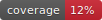

# ocd - Obsidian CSS Diff

Extract and diff `app.css` across Obsidian versions. Downloads Obsidian's ASAR
bundle directly from GitHub releases - no Docker or Node.js needed.

## Install

### go install

```bash
go install github.com/bladeacer/ocd@latest
ocd
```

### From source

```bash
git clone https://github.com/bladeacer/ocd
cd ocd
make build
./ocd
```

### Pre-built binaries

Download from [releases](https://github.com/bladeacer/ocd/releases) (linux/windows/darwin, amd64/arm64).

```bash
curl -LO https://github.com/bladeacer/ocd/releases/latest/download/ocd_linux_amd64.tar.gz
tar xzf ocd_linux_amd64.tar.gz
sudo mv ocd /usr/local/bin/
```

## Usage

### Interactive TUI

```bash
ocd interact
```

Browse versions — fetches RSS changelog, Docker Hub tags, and Electron-Chromium
mappings asynchronously. Loading messages rotate and show elapsed time.

| Key | Action |
|-----|--------|
| `↑` `↓` | Navigate rows |
| `←` `→` | Scroll columns |
| `enter` | Select version for CSS extraction |
| `/` | Enter search mode — type to filter table live |
| `m` | Toggle mobile versions |
| `e` | Toggle early access / insider versions |
| `f` | Show only versions with Docker images |
| `s` | Toggle sort priority: extracted CSS first → Docker found → N/A → missing |
| `?` | Toggle help overlay |
| `Esc` | Close search / help overlay |
| `q` / `ctrl+c` | Quit |

### Diff versions

```bash
ocd diff -p          # interactive picker (two-step selection)
ocd diff 1.12.6 1.12.7  # direct CLI
ocd diff --tldr 1.12.6 1.12.7  # TLDR analysis (CSS heuristics) + TOML export
ocd diff --tldr --tldr-format json 1.12.6 1.12.7  # TLDR as JSON
```

The diff viewer opens with scrollable, colorized output. Active hunk lines
are highlighted with a blue background.

| Key | Action |
|-----|--------|
| `↑` `↓` `j` `k` | Scroll one line |
| `pgup` `pgdn` | Scroll one page |
| `{}` | Jump prev/next diff hunk |
| `gg` / `G` | Jump to top / bottom of diff |
| `zz` / `zt` / `zb` | Center / top / bottom current hunk |
| `n` / `N` | Next / previous (search match when searching, else hunk) |
| `/` | Search within diff — highlights matching pattern |
| `v` | Toggle side-by-side view |
| `y` | Yank current hunk to clipboard |
| `Y` | Yank entire diff to clipboard |
| `yy` | Yank current hunk line content |
| `e` | Export TLDR analysis to TOML |
| `o` | Open diff viewer (`$OCD_DIFF_PAGER` / `$EDITOR` / `delta` / `less -R`) |
| `?` | Toggle help overlay |
| `Esc` | Close search / help overlay |
| `q` / `ctrl+c` | Quit diff viewer |

Picker mode (when called with `-p`):

| Key | Action |
|-----|--------|
| `↑` `↓` | Navigate versions |
| `enter` | Select version |
| `/` | Search/filter versions |
| `m` | Toggle mobile versions |
| `q` / `ctrl+c` | Cancel |

### Extract specific version

```bash
ocd extract 1.12.7
```

### Clean cache

```bash
ocd clean
```

## Commands

| Command | Description |
|---------|-------------|
| `interact` | TUI browser with async loading, search, filters, CSS status column |
| `extract <ver>` | Download + extract `app.css` from GitHub releases |
| `diff [a] [b]` | Interactive picker or direct diff with colored viewer |
| `clean` | Wipe `.obsidian_cache/` metadata and extracted CSS |

## How it works

1. Fetches version list from Obsidian's RSS changelog
2. Cross-references with Docker Hub availability and Electron-to-Chromium mappings
3. Extracts `app.css` directly from `obsidian-{version}.asar.gz` on GitHub releases
4. Parses the Electron ASAR archive in pure Go — no external tools needed

## Development

```bash
make build       # build binary
make test        # run unit tests
make cover       # tests + coverage report
make cover-html  # tests + HTML coverage report in browser
make fmt         # go fmt + go vet
make lint        # golangci-lint
make release-test  # goreleaser snapshot (no upload)
make clean       # remove binary and cache
```

Tests cover RSS electron fill, Docker tag parsing, ASAR extraction,
CSS diff, cache operations and other details.

## License

GPL-3.0.
